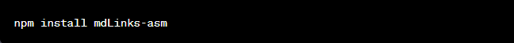
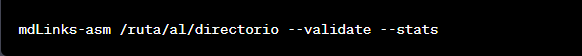
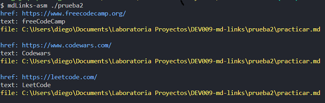
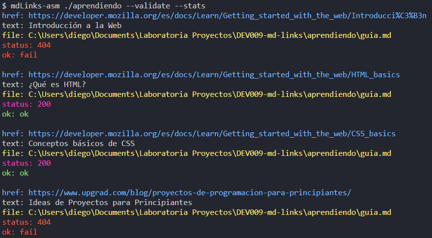
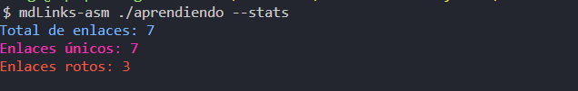
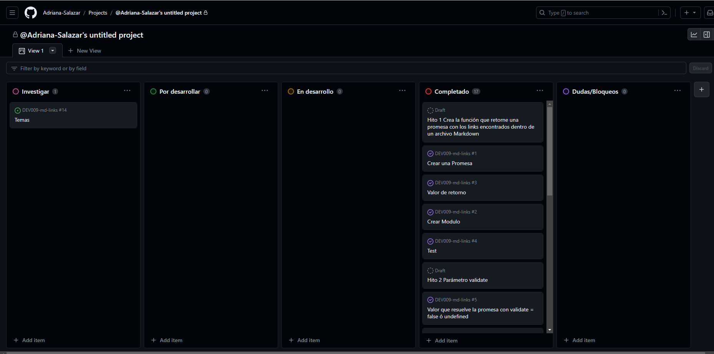

# Markdown Links

## Índice

* [1. Preámbulo](#1-preámbulo)
* [2. Resumen del proyecto](#2-resumen-del-proyecto)
* [3. Instalación](#3-instalación)
* [4. Guía de uso](#4-guía-de-uso)
* [5. Resultados](#5-resultados)
* [6. Diagrama de flujo](#6-diagrama-de-flujo)
* [7. Planificación y Organización del Proyecto](#7-planificación-y-organización-del-proyecto)

***

## 1. _Preámbulo_

[Markdown](https://es.wikipedia.org/wiki/Markdown) Markdown es un lenguaje de marcado sencillo que sirve para agregar formato, vínculos e imágenes con facilidad al texto simple; en principio, fue pensado para elaborar textos cuyo destino iba a ser la web con más rapidez y sencillez que si estuviésemos empleando directamente HTML.  Actualmente es usado en muchísimas plataformas que manejan texto plano (GitHub, foros, blogs, etc.) y es muy común encontrar varios archivos en ese formato en cualquier tipo de
repositorio (empezando por el tradicional `README.md`).

Estos archivos `Markdown` normalmente contienen _links_ (vínculos/ligas) que
muchas veces están rotos o ya no son válidos y eso perjudica mucho el valor de
la información que se quiere compartir.

Dentro de una comunidad de código abierto, nos han propuesto crear una
herramienta usando [Node.js](https://nodejs.org/), que lea y analice archivos
en formato `Markdown`, para verificar los links que contengan y reportar
algunas estadísticas.

## 2. _Resumen del proyecto_

En este proyecto se desarrolló una librería en Node.js que permite analizar archivos Markdown en un directorio y encontrar los enlaces contenidos en ellos. Puedes usar esta librería para realizar las siguientes tareas:

- Extraer información sobre los enlaces, como la URL, el texto del enlace y el archivo donde se encuentra.
- Validar enlaces HTTP para verificar su estado.
- Obtener estadísticas sobre los enlaces encontrados, como el total de enlaces, enlaces únicos y enlaces rotos.

## 3. _Instalación_

Para utilizar la librería mdLinks, primero debes instalarla en tu proyecto. Puedes hacerlo a través de npm (Node Package Manager) ejecutando el siguiente comando en la terminal:

## 4. _Guía de uso_

### Desde la línea de comandos (CLI):
Puedes usar la librería mdLinks desde la línea de comandos de la siguiente manera:

Donde < ruta-del-directorio > es la ruta al directorio que deseas analizar y [opciones] son las siguientes:

- --validate: Esta opción permite validar los enlaces HTTP encontrados.
- --stats: Esta opción muestra estadísticas sobre los enlaces encontrados.

Ejemplos de uso:

Puedes combinar ambas opciones para obtener información detallada sobre los enlaces:

## 5. _Resultados_
La función mdLinks mostrará en la terminal, una lista de enlaces encontrados en los archivos Markdown del directorio especificado con la siguiente estructura:

- href: La URL del enlace.
- text: El texto del enlace.
- file: La ruta del archivo donde se encuentra el enlace.

Si se utilizan las opciones --validate o --stats, se mostrarán estadísticas o información de validación adicional, respectivamente.

- status: El estado de la validación del enlace (solo si se utiliza la opción --validate).
- ok: Indica si el enlace es válido o no (solo si se utiliza la opción --validate).

### Ejemplos
Ejemplo 1: Obtener enlaces sin validación

Este comando mostrará una lista de enlaces encontrados en los archivos Markdown del directorio especificado.

Ejemplo 2: Obtener enlaces con validación

Este comando mostrará una lista de enlaces con información de validación, incluyendo el estado y la validez de cada enlace.

Ejemplo 3: Obtener estadísticas de enlaces

Este comando mostrará estadísticas sobre los enlaces encontrados, incluyendo el total de enlaces, enlaces únicos y enlaces rotos.

## 6. _Diagrama de Flujo_

## 7. _Planificación y Organización del Proyecto_

Este proyecto se desarrolla siguiendo una metodología ágil y aprovecha los tableros de proyectos de GitHub para una organización eficiente y un seguimiento efectivo del progreso.

### Fases del Proyecto

Se ha dividido el proyecto en cinco fases diferentes, cada una de ellas representa un Hito para la elaboración del proyecto. 

### Tablero de Proyectos de GitHub (Github projects)

Se utilizó el tablero de proyectos de GitHub para gestionar las tareas de manera sistemática; El tablero está organizado en varias columnas que representan diferentes etapas del desarrollo:

1. Investigar: Esta columna contiene temas y conceptos a investigar o reforzar.

2. Por desarrollar: Esta columna contiene las tareas a desarrollar dentro de los hitos planificados en el proyecto.

3. En desarrollo: Las tareas e hitos en las que está trabajando activamente se mueven a esta columna.

3. Completado: Las tareas que han sido revisadas y los hitos terminados con éxito se trasladan a esta columna.

4. Dudas/Bloqueos: dudas o bloqueos que se presentaron en el desarrollo del proyecto.

